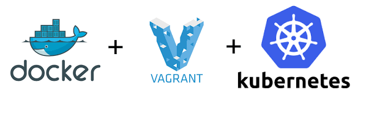

# *kubernetes-the-easy-way*
This repo will show the easy method to spin up fully function kubernetes cluster from scratch!

This repo will help one to setup our own vanilla kubernetes cluster setup in their local workstation from scratch. This is full pre-configured solutions and one can use this to just setup a cluster quick to play-around. Incase if you want to learn all the concepts deeply then I would highly recommend to follow [Kube Docs](https://kubernetes.io/docs/setup/production-environment/tools/kubeadm/install-kubeadm/) or some sample setup guide like [Kube Hard way](https://github.com/kelseyhightower/kubernetes-the-hard-way)

## Pre-requisite

In order to effectively use this script, we need following components to be installed prior running this script:

- Docker
- Vagrant
- Oracle Virtual box
- Git

## Trigger

All the configuration to build the clusters are predefined. To start,

Run `.build_cluster.sh`

This is spin up one master and two node k8s cluster with the all the needed componetes with latest version.

Post successful completion of the script:

± You can login into the machine by running `vagrant ssh master` , ` vagrant ssh node1` and so on.

## Tear Down

__To stop the VM__

Run `vagrant halt`

This is shutdown your vm gracefully.

__To destroy the VM__

Run `vagrant destroy`

This is destroy and free up the resources

For *forceful* delete

Run `vagrant destroy -f`

__To just reload(update the config)__

Run `vagrant reload`

This will ensure the latest update to the config files or script is reloaded

__ To bring the cluster up after deletion__

Run `vagrant up`

Will spin up a new cluster.

## Follow-Me

:id:            

### ~~Reference~~

Followed @pbacterio script and so credits to him :) 

Made small changes to make the script work smoothly and to run all the kubernetes components at its latest version. Also rectified the issue in connecting the nodes with the master automatically during creation process.

